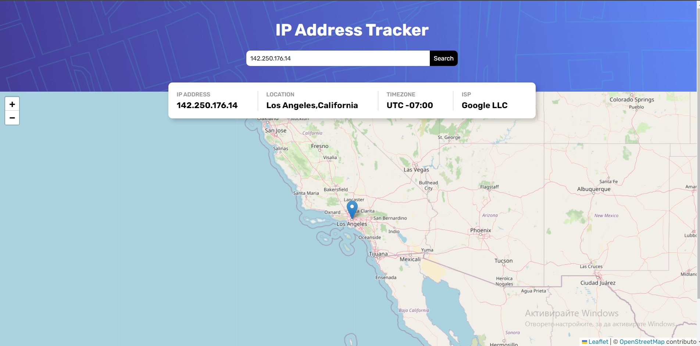

<h1 align="center">
 IP Tracker
</h1>

<p>A small REST API ReactJS application that shows your IP and it's location.
It also allows you to search by domain name or ip address.
</p>



## 🚀 Demo
<a href='https://ip-tracker-taupe-chi.vercel.app/'>https://ip-tracker-taupe-chi.vercel.app/</a>

## 🛠️ Installation Steps

1. Clone the repository

```bash
git clone https://github.com/SDdev2017/ip-tracker.git
```

2. Change the working directory

```bash
cd project
```

3. Install dependencies

```bash
npm install
```

4. Run the app

```bash
npm start
```

## 💻 Built with

- ReactJS
- Sass (CSS preprocessor)
- PropTypes - for types security
- [Ipify](https://geo.ipify.org): GEO Location API
- [Leaflet](https://leafletjs.com/): an open-source JavaScript library
for mobile-friendly interactive maps
